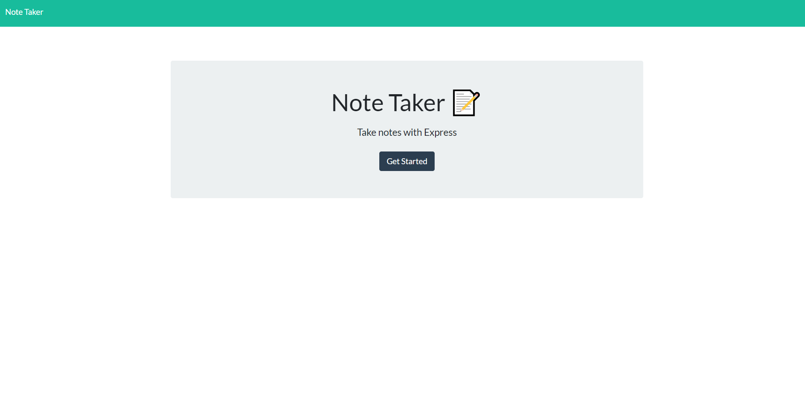

# Readme Generator
# License
 
[Deployed Site](https://rocky-ravine-86294.herokuapp.com/)

# Table of Contents
[Description](#description) 
[Installation](#installation) 
[Usage](#usage) 
[License](#license) 
[Contributing](#contributing) 
[Tests](#tests) 
[Questions](#questions) 
# Description
# Installation
Download the code from github, then open a terminal where the package.json is located. Run npm install to install the required packages.
# Usage
Open a terminal where the server.js is located, run node server.js to begin start the server, then proceed to https://localhost:3001 in your browser.
# Contributing
Travis Crocker
# Tests
### How to test the application.
no tests
# Questions
### For questions contact me using the information below.
Travis.Crocker.Dev@gmail.com [github](https://Github.com/tmcrocker89)
